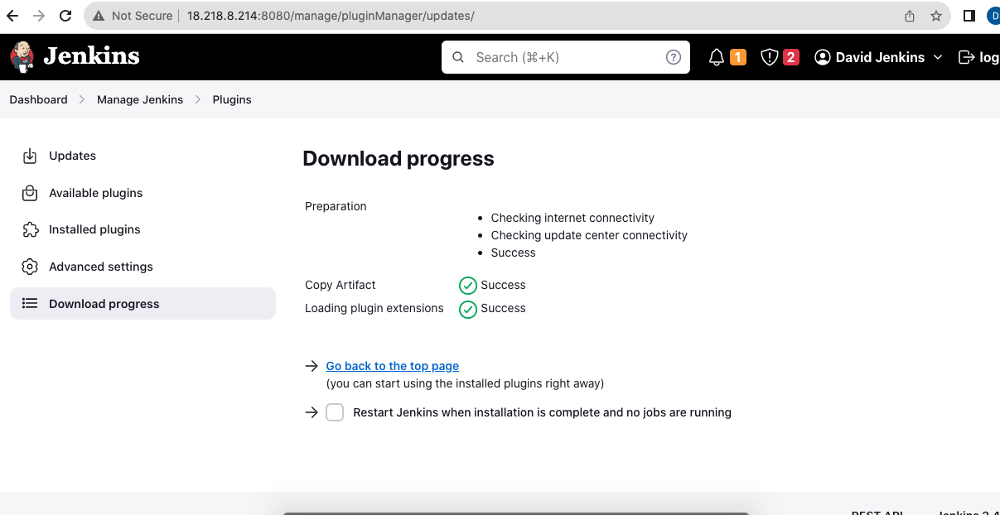
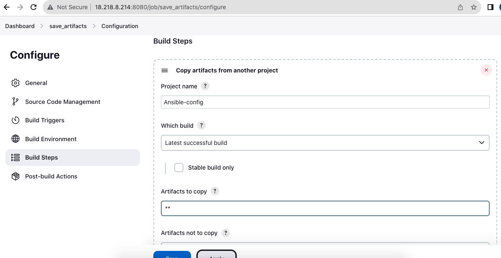
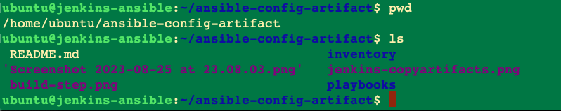
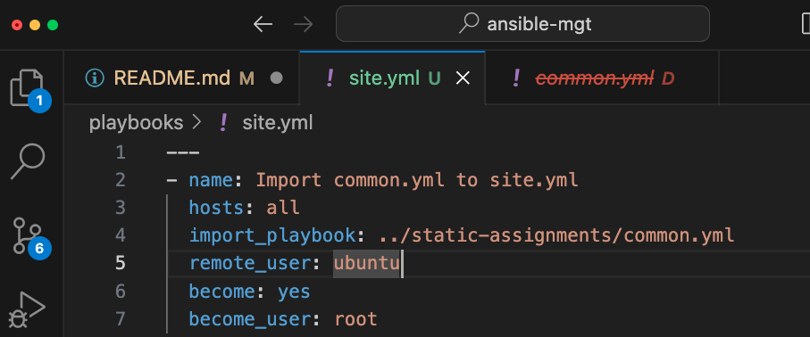
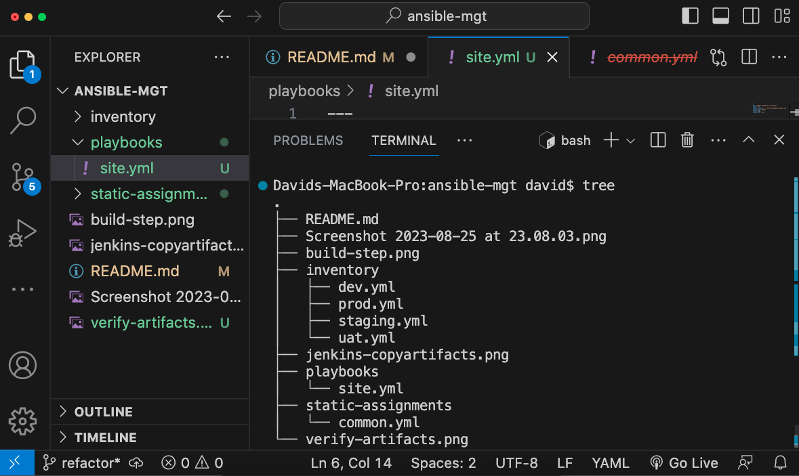
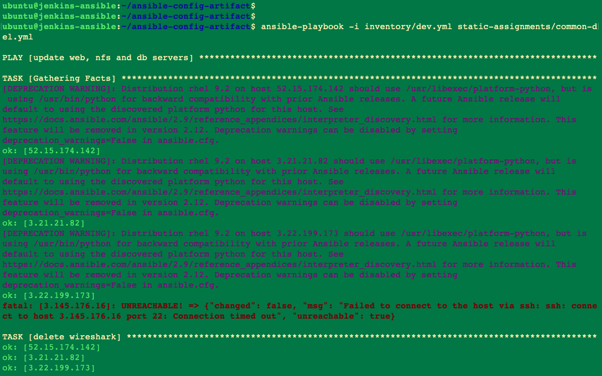
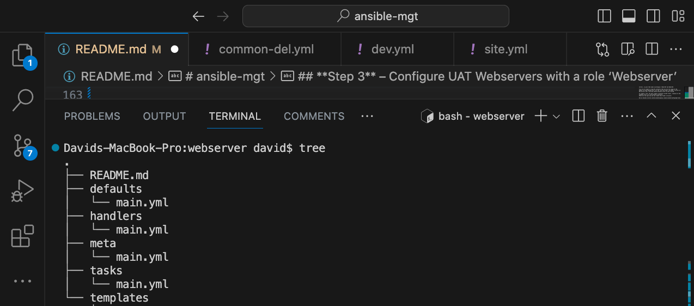
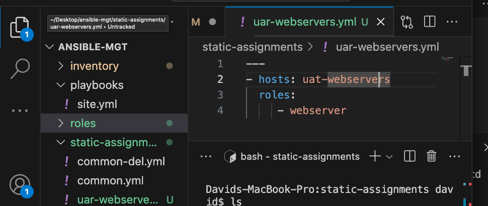

# ansible-mgt
Continuous Integration /CD to the pipeline with  ansible. & MORE

#####
ANSIBLE REFACTORING AND STATIC ASSIGNMENTS (IMPORTS AND ROLES)

---
I'll refactor the  Ansible code, create assignments, and use the imports functionality. Imports allow to effectively re-use previously created playbooks in a new playbook – 
The main idea of refactoring is to enhance code readability, increase maintainability and extensibility, reduce complexity, add proper comments without affecting the logic.

***

#### STEP 1
 1. Jenkins job enhancement
 ___

Make some changes to our Jenkins job – now every new change in the codes creates a separate directory which is not very convenient when we want to run some commands from one place. Besides, it consumes space on Jenkins serves with each subsequent change. Let us enhance it by introducing a new Jenkins project/job – we will require Copy Artifact plugin.

In the  Jenkins-Ansible server , I'll create a new directory called ansible-config-artifact – We'll store all artifacts there after each build.

`sudo mkdir /home/ubuntu/ansible-mgt-artifact`

Change permissions to this directory, so Jenkins could save files there – `chmod -R 0777 /home/ubuntu/ansible-mgt-artifact`

Go to Jenkins web console -> Manage Jenkins -> Manage Plugins -> on Available tab search for Copy Artifact and install this plugin without restarting Jenkins



screenshoT **'

Create a new Freestyle project (you have done it in Project 9) and name it save_artifacts.

This project will be triggered by completion of your existing ansible project. Configure it accordingly: 


screenshots 


Note: You can configure number of builds to keep in order to save space on the server, for example, you might want to keep only last 2 or 5 build results. You can also make this change to your ansible job.

The main idea of save_artifacts project is to save artifacts into `/home/ubuntu/ansible-config-artifact` directory. 

To achieve this, create a Build step and choose Copy artifacts from other project, specify ansible as a source project and /home/ubuntu/ansible-config-artifact as a target directory.



---

Test the set up by making some change in README.MD file inside your ansible-mgt repository (right inside master branch).
If both Jenkins jobs have completed one after another – you shall see your files inside /home/ubuntu/ansible-config-artifact directory and it will be updated with every commit to your master branch.

Now your Jenkins pipeline is neater


Verify the presence of the artifacts on the server .


---

#### 
REFACTOR ANSIBLE CODE BY IMPORTING OTHER PLAYBOOKS INTO SITE.YML
_____________
Step 2 – 

Refactor Ansible code by importing other playbooks into site.yml


Earlier we created a single playbook common.yml-a simple set of instructions for only 2 types of OS, but when you have many more tasks and you need to apply this playbook to other servers with different requirements. In this case, you will have to read through the whole playbook to check if all tasks written there are applicable . and is there anything that you need to add for certain server/OS families. Very fast it will become a tedious exercise and your playbook will become messy with many commented parts. Your DevOps colleagues will not appreciate such organization of your codes and it will be difficult for them to use your playbook.

Most Ansible users learn the one-file approach first. However, breaking tasks up into different files is an excellent way to organize complex sets of tasks and reuse them.

Let see code re-use in action by importing other playbooks.

1. Within playbooks folder, create a new file and name it site.yml – This file will now be considered as an entry point into the entire infrastructure configuration. Other playbooks will be included here as a reference. In other words, site.yml will become a parent to all other playbooks that will be developed. Including common.yml that you created previously. 

2. Create a new folder in root of the repository and name it `static-assignments`

 The static-assignments folder is where all other children playbooks will be stored. This is merely for easy organization of your work. It is not an Ansible specific concept, therefore you can choose how you want to organize your work. 

3. Move common.yml file into the newly created static-assignments folder.

4. Inside site.yml file, import common.yml playbook.



Your folder structure should now loook like this . The `tree` command helps.




5. Run ansible-playbook command against the dev environment

Since you need to apply some tasks to your dev servers and wireshark is already installed – you can go ahead and create another playbook under static-assignments and name it `common-del.yml`. 

 In this playbook, configure deletion of wireshark utility.


 
 
 `- name: update web, nfs and db servers
  hosts: webservers, nfs, db
  remote_user: ec2-user
  become: yes
  become_user: root
  tasks:
  - name: delete wireshark
    yum:
      name: wireshark
      state: removed

- name: update LB server
  hosts: lb
  remote_user: ubuntu
  become: yes
  become_user: root
  tasks:
  - name: delete wireshark
    apt:
      name: wireshark-qt
      state: absent
      autoremove: yes
      purge: yes
      autoclean: yes`

update site.yml with - import_playbook: ../static-assignments/common-del.yml instead of common.yml and run it against dev servers:

`cd /home/ubuntu/ansible-mgt/`

`ansible-playbook -i inventory/dev.yml playbooks/site.yaml`

> Make sure that wireshark is deleted on all the servers by running wireshark --version

Now you have learned how to use import_playbooks module and you have a ready solution to install/delete packages on multiple servers with just one command

Before running your playbook, you can pass a `--check` flag to your command to do a validation first.



---
________________

CONFIGURE UAT WEBSERVERS WITH A ROLE ‘WEBSERVER’

**Step 3** – Configure UAT Webservers with a role ‘Webserver’
---


We a clean `dev` environment, so let us put it aside and configure 2 new Web Servers as UAT. We could write tasks to configure Web Servers in the same playbook, but it would be too messy, instead, we will use a dedicated role to make our configuration reusable.

Launch 2 fresh EC2 instances using RHEL 8 image, we will use them as our uat servers, so give them names accordingly – Web1-UAT and Web2-UAT.

Tip: Do not forget to stop EC2 instances that you are not using at the moment to avoid paying extra. For now, you only need 2 new RHEL 8 servers as Web Servers and 1 existing Jenkins-Ansible server up and running.

To create a role, you must create a directory called roles/, relative to the playbook file or in /etc/ansible/ directory.
There are two ways how you can create this folder structure:

Use an Ansible utility called ansible-galaxy inside ansible-config-mgt/roles directory (you need to create roles directory upfront)

`mkdir roles`
`cd roles`
`ansible-galaxy init webserver`

Create the directory/files structure manually
Note: You can choose either way, but since you store all your codes in GitHub, it is recommended to create folders and files there rather than locally on Jenkins-Ansible server.

The entire folder structure should look like below, but if you create it manually – you can skip creating tests, files, and vars or remove them if you used ansible-galaxy



---

#### 

REFERENCE THE WEBSERVER ROLE


Within the **static-assignments** folder, create a new assignment for uat-webservers `uat-webservers.yml` This is where you will reference the role.



Remember that the entry point to our ansible configuration is the `site.yml` file. Therefore, you need to refer your `uat-webservers.yml` role inside `site.yml`


#### Step 5 – Commit & Test

Commit your changes, create a Pull Request and merge them to master branch, **_make sure webhook triggered two consequent Jenkins jobs_**,f they ran successfully and copied all the files to your Jenkins-Ansible server into /home/ubuntu/ansible-config-mgt/ directory.


Now run the playbook against your uat inventory and see what happens:

`sudo ansible-playbook -i /home/ubuntu/ansible-config-artifact/inventory/uat.yml /  home/ubuntu/ansible-config-artifact/playbooks/site.yml`

You should be able to see both of your UAT Web servers configured and you can try to reach them from your browser:


tests and screenshots.


AWS dashboard showing the servers


Day I completed this.


Now the achitecture looks like this .

[Architecture](/images/architecture.png)

________
---

I'll introduce dynamic assignments by using include module.

What is the difference between static and dynamic assignments?

From the previous project you can tell that static assignments use import Ansible module. The module that enables dynamic assignments is **include**.

Hence,

> import = Static
  include = Dynamic
---

Note, in most cases it is recommended to use static assignments for playbooks, because it is more reliable. With dynamic ones, it is hard to debug playbook problems due to its dynamic nature. However, you can use dynamic assignments for environment specific variables 


#### 

INTRODUCING DYNAMIC ASSIGNMENT INTO OUR STRUCTURE

GitHub repository start a new branch and call it dynamic-assignments.

Create a new folder, name it dynamic-assignments. Then inside this folder, create a new file and name it env-vars.yml. We will instruct site.yml to include this playbook later. For now, let us keep building up the structure.

Since we will be using the same Ansible to configure multiple environments, and each of these environments will have certain unique attributes, such as servername, ip-address etc., we will need a way to set values to variables per specific environment.

For this reason, we will now create a folder to keep each environment’s variables file. Therefore, create a new folder env-vars, then for each environment, create new YAML files which we will use to set variables.

Your layout should now look like this.


Now paste the instruction below into the env-vars.yml file.


```
---
- name: collate variables from env specific file, if it exists
  hosts: all
  tasks:
    - name: looping through list of available files
      include_vars: "{{ item }}"
      with_first_found:
        - files:
            - dev.yml
            - stage.yml
            - prod.yml
            - uat.yml
          paths:
            - "{{ playbook_dir }}/../env-vars"
      tags:
        - always
        ```
        ---

Notice 3 things to notice here:

We used `include_vars` syntax instead of `include`, this is because Ansible developers decided to separate different features of the module. From Ansible version 2.8, the include module is deprecated and variants of `include_*` must be used. These are:

```
include_role
include_tasks
include_vars

```


In the same version, variants of import were also introduces, such as:

```
import_role
import_tasks
```

We made use of a special variables { playbook_dir } and { inventory_file }. { playbook_dir } will help Ansible to determine the location of the running playbook, and from there navigate to other path on the filesystem. { inventory_file } on the other hand will dynamically resolve to the name of the inventory file being used, then append .yml so that it picks up the required file within the env-vars folder.

We are including the variables using a loop. `with_first_found` implies that, looping through the list of files, the first one found is used. This is good so that we can always set default values in case an environment specific env file does not exist


---

UPDATE SITE.YML WITH DYNAMIC ASSIGNMENTS

Update site.yml file to make use of the dynamic assignment. At this point, we cannot test it yet. We are just setting the stage for what is yet to come. 

`site.yml` should now look like this.

```
---
- hosts: all
- name: Include dynamic variables 
  tasks:
  import_playbook: ../static-assignments/common.yml 
  include: ../dynamic-assignments/env-vars.yml
  tags:
    - always

-  hosts: webservers
- name: Webserver assignment
  import_playbook: ../static-assignments/webservers.yml

```

#### 
Community Roles 
#


Now it is time to create a role for MySQL database – it should install the MySQL package, create a database and configure users. But why should we re-invent the wheel? There are tons of roles that have already been developed by other open source engineers out there. These roles are actually production ready, and dynamic to accomodate most of Linux flavours. With Ansible Galaxy again, we can simply download a ready to use ansible role, and keep going.

---

#### Download Mysql Ansible Role

You can browse available community roles on the ansible website

We will be using a MySQL role developed by `geerlingguy`

Hint: To preserve your your GitHub in actual state after you install a new role – make a commit and push to master your ‘ansible-mgt’ directory. Of course you must have git installed and configured on Jenkins-Ansible server and, for more convenient work with codes, you can configure Visual Studio Code to work with this directory.

 In this case, you will no longer need webhook and Jenkins jobs to update your codes on Jenkins-Ansible server, so you can disable it – we will be using Jenkins later for a better purpose.

On Jenkins-Ansible server make sure that git is installed with git --version, then go to ‘ansible-config-mgt’ directory and run:


```
git init
git pull https://github.com/therealqz/ansible-mgt.git
git remote add origin https://github.com/therealqz/ansible-mgt.git
git branch roles-feature
git switch roles-feature

```

========

git ?